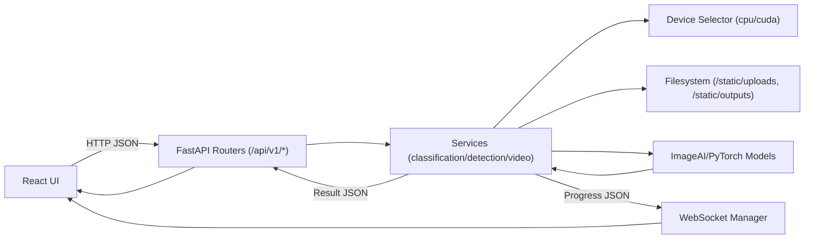

# Architecture

## System Overview
The system now includes:
- A FastAPI backend that exposes REST endpoints for image classification, object detection, and video detection, along with a WebSocket endpoint for real-time video job progress. The backend also serves static files for uploads and outputs.
- A React (Vite + TypeScript) frontend that provides a minimal UI and an API client that integrates with the backend.

The original Python package (imageai) remains for in-process usage. The new HTTP API wraps these capabilities for web clients and is designed for local development and Docker-based deployment.

## Components

### Backend (FastAPI)
- Entry point: backend/app/main.py
  - Configures CORS via ALLOW_ORIGINS
  - Exposes REST routes under /api/v1
  - Mounts static files under /static to serve uploads and outputs
  - Registers routers:
    - classification: backend/app/api/v1/routes_classification.py
    - detection: backend/app/api/v1/routes_detection.py
    - video + websocket: backend/app/api/v1/routes_video.py
- Configuration: backend/app/core/config.py
  - DATA_DIR, UPLOAD_DIR, OUTPUT_DIR, MODEL_DIR (env override)
  - OpenAPI tags definition
- Device handling: backend/app/core/devices.py
  - get_device_info(): returns CPU/GPU availability and counts
  - select_device(): returns "cuda" if available, else "cpu"
- Schemas: backend/app/models/schemas.py
  - ErrorResponse, ClassificationResponse, DetectionResponse, VideoJobResponse, VideoStatusResponse and related subtypes
- WebSocket manager: backend/app/websocket/manager.py
  - Manages client connections per job_id and broadcasts JSON events
- Services (implementation detail):
  - classification_service.py, detection_service.py, video_service.py encapsulate core logic and filesystem interactions

### Frontend (React + Vite + TypeScript)
- API base configuration: frontend/src/config.ts
  - getApiBaseUrl() from VITE_API_BASE_URL
  - getWsBaseUrl() derived from API base (http -> ws, https -> wss)
- API client: frontend/src/api/client.ts
  - Axios client with baseURL from config
  - Functions for health, classification, detection, video start, and WebSocket open
- Types: frontend/src/api/types.ts
  - Response and message types used by components
- Components/Pages:
  - Upload and preview components, pages for classification, detection, and video detection

### Static Files and Paths
- Backend mounts /static -> backend/app/data
  - Uploads saved to /static/uploads
  - Outputs saved to /static/outputs
- URLs returned by API include these static prefixes so the frontend can render previews directly.

## API Surface

### REST
- GET /api/v1/health
- POST /api/v1/classify
- POST /api/v1/detect
- POST /api/v1/video/detect
- GET /api/v1/video/status/{job_id}

### WebSocket
- WS /ws/video/{job_id}

Refer to docs/APIReference.md for precise request/response schemas and error handling.

## Data Flow (Request Lifecycle)

## Deployment and Environments

### Local Development
- Backend: http://localhost:8000 (uvicorn with --reload)
- Frontend: http://localhost:5173 (Vite dev server)
- CORS: ALLOW_ORIGINS should include http://localhost:5173

### Docker Compose
- Services: backend, frontend on a shared network
- Inside network:
  - Backend: http://backend:8000
  - Frontend: http://frontend:5173
- Exposed to host:
  - Backend: localhost:8000
  - Frontend: localhost:5173
- Volumes:
  - ./data -> /app/app/data
  - ./models -> /app/app/data/models

### Environment Variables
- MODEL_DIR: backend models directory (default /app/app/data/models)
- ALLOW_ORIGINS: comma-separated list (default http://localhost:5173)
- VITE_API_BASE_URL: frontend API base (Compose default http://backend:8000)

## Error Handling
- REST errors returned as JSON { "detail": string } with appropriate HTTP codes (400, 404, 500)
- WebSocket errors are pushed as JSON events with type "error"

## Security Considerations
- CORS restricted by ALLOW_ORIGINS
- No secrets are committed; .env can override defaults for development
- Uploaded files are saved under /static/uploads; ensure appropriate access controls if deployed beyond local dev

## Known Integration Note
- The frontend startVideoDetection() must call POST /api/v1/video/detect. Ensure the route matches the backend router. If necessary, add a frontend update or a backend alias.

## Future Extensions
- Add /api/v1/models to list available models when model registry is exposed
- Add pagination and filtering for historical jobs
- Implement authentication and rate limiting for production deployments

---
Conversion to PDF: To render this document to PDF locally, install pandoc and run:
- Linux/macOS: pandoc -s docs/Architecture.md -o docs/Architecture.pdf
- Windows (PowerShell): pandoc -s docs/Architecture.md -o docs/Architecture.pdf

