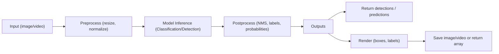

# Architecture Document

## System Overview
ImageAI-4381 is a Python backend library that provides high-level computer vision capabilities for image classification, object detection, video analysis, and custom model training. It is designed as an importable Python package (imageai) intended for use in scripts, notebooks, and batch pipelines. There is no HTTP server or web API component. The active backend is PyTorch; TensorFlow/Keras code is retained only under imageai_tf_deprecated for archival purposes.

PDF export: To render this document to PDF locally, install pandoc and run:
- Linux/macOS: pandoc -s docs/Architecture.md -o docs/Architecture.pdf
- Windows (PowerShell): pandoc -s docs/Architecture.md -o docs/Architecture.pdf

## Key Components and Modules
- Backend guardrails
  - imageai/backend_check/backend_check.py ensures PyTorch/TorchVision presence and surfaces clear errors if a TensorFlow environment is detected inadvertently.
- Classification
  - imageai/Classification/__init__.py implements ImageClassification with support for MobileNetV2, ResNet50, InceptionV3, DenseNet121. It handles model selection, weight loading, preprocessing, and inference.
- Detection (Images)
  - imageai/Detection/__init__.py exposes ObjectDetection. It supports:
    - YOLOv3 and TinyYOLOv3 via internal implementations under imageai/yolov3.
    - RetinaNet via torchvision.models.detection.retinanet_resnet50_fpn.
  - Utilities for reading images, preparing inputs, running NMS, drawing boxes/labels, and extracting detected objects.
- Detection (Video)
  - imageai/Detection/__init__.py exposes VideoObjectDetection built atop ObjectDetection with per-frame, per-second, and per-minute processing callbacks.
- Custom Detection
  - imageai/Detection/Custom/__init__.py provides:
    - DetectionModelTrainer for YOLOv3/TinyYOLOv3 training on YOLO-formatted datasets.
    - CustomObjectDetection and CustomVideoObjectDetection for inference using custom-trained models and configuration JSON files.
  - YOLO utilities and dataset classes under imageai/Detection/Custom/yolo/*.
- Examples and Utilities
  - examples/: runnable scripts for classification, detection, video analysis, and training.
  - scripts/pascal_voc_to_yolo.py: dataset conversion helper.

## Model Support Matrix (Classification/Detection/Video)
- Classification
  - Backbones: MobileNetV2, ResNet50, InceptionV3, DenseNet121.
  - Weights: Load from .pth files compatible with the selected backbone.
- Detection (Images)
  - YOLOv3 (.pt), TinyYOLOv3 (.pt).
  - RetinaNet (.pth), using TorchVision’s retinanet_resnet50_fpn with 91 classes (COCO-91 mapping).
- Detection (Video)
  - Same detection backends as for images; wrapped in a frame processing pipeline with optional saving of annotated videos.

## Data Flow Diagrams (high-level)

## Dependency Graph and Third-party Libraries
- Core frameworks
  - PyTorch (torch), TorchVision (torchvision) for models and preprocessing pipelines.
- Vision and numerics
  - NumPy, Pillow (PIL), OpenCV (cv2), SciPy, Matplotlib.
- Utilities
  - tqdm (progress), pytest/mock (testing).
- Optional extras
  - pycocotools when training/evaluating detection models with COCO-like tooling.
- Packaging
  - setup.py for packaging; dependencies are managed via requirements files (CPU/GPU variants, extras).

## Configuration and Environment Variables
- No mandatory environment variables are required by default.
- Common variables that users might set externally:
  - CUDA_VISIBLE_DEVICES to control GPU visibility.
- If future configuration is needed (e.g., model cache directories), include .env.example and document usage.

## GPU/CPU Execution Paths
- The library auto-detects GPU availability (torch.cuda.is_available()):
  - On GPU: models and tensors move to CUDA device for accelerated inference/training.
  - On CPU: the pipelines run with CPU tensors; performance is lower but functional.
- Forcing CPU is supported by useCPU() methods in ImageClassification, ObjectDetection, and custom detection classes.

## Error Handling and Logging
- Dependency checks raise RuntimeError with clear guidance (backend_check.py).
- Input validation:
  - Model paths are verified and file extension checked (model_extension/extension_check).
  - Image input types validated; readable extensions enforced (jpg, jpeg, png).
- Inference and training errors:
  - Weight loading mismatches raise RuntimeError (“Invalid weights”).
  - Training logs include progress via tqdm and periodic evaluation (mAP metrics).
- Warnings:
  - Emits ResourceWarning for cases like model path changes without reloading.

## Performance Considerations
- Throughput improves significantly with a capable NVIDIA GPU and CUDA-enabled PyTorch.
- YOLOv3/TinyYOLOv3:
  - Tiny variant is suited for faster, lower-accuracy scenarios.
  - NMS and objectness thresholds materially affect performance and result density.
- RetinaNet via TorchVision provides a robust baseline; ensure matching number of classes and weights.
- Video processing:
  - frames_per_second and frame_detection_interval control compute load.
  - Callbacks can add overhead; use sparingly in high-FPS scenarios.

## Security and Compliance Considerations
- No network services or persistent credentials are embedded in the codebase.
- Users should vet third-party weights and datasets for license compliance.
- When packaging/redistributing models, ensure adherence to model licenses and dataset terms.
- Avoid executing untrusted code or loading arbitrary weights without validation.

## Testing Strategy
- Unit/integration tests under test/ verify:
  - Classification across supported backbones.
  - Detection for YOLOv3/TinyYOLOv3 and RetinaNet, including custom object filtering and extraction.
  - Video detection basic flows are covered in dedicated tests.
- Local testing recommendation:
  - Create a virtual environment, install requirements, and run pytest with sample assets.

## Future Improvements
- Weight management:
  - Built-in downloads, caching, and checksum verification.
- Training:
  - Config-driven runs, richer logs/metrics, and automatic artifact/versioning handling.
- Interoperability:
  - ONNX export and ONNX Runtime inference paths; potentially TensorRT guidance.
- Developer Experience:
  - Adopt Black/isort/Ruff, pre-commit, type checking, and CI matrices for CPU/GPU where feasible.
- Documentation:
  - Consolidate API docs and add architecture diagrams for YOLO and RetinaNet internals.

---
Conversion to PDF: See pandoc command at the beginning of this document.

