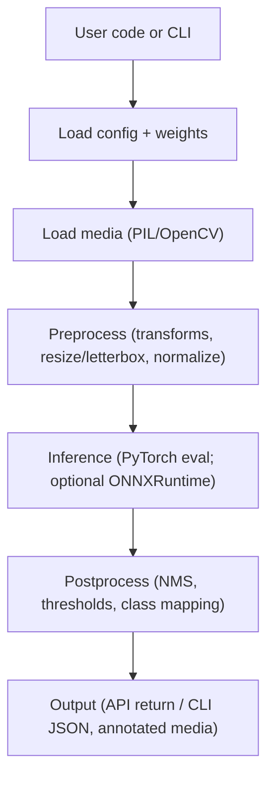

# Security Insight & Dependency Map for ImageAI-4381

## Title Page
Security Insight & Dependency Map for ImageAI-4381  
Author: Sarfraj Ahamed  
Role: Kavia AI – AI Intern (Computer Vision Track)  
Date: October 2025  
Repository: ImageAI-4381  
Scope: Python library and CLI scripts for image classification, object detection, video analysis, and custom training with CPU/GPU support

## Objective / Goal
The purpose of this document is to provide a clear, goal-oriented overview of ImageAI-4381’s dependency surface, execution workflow, and security posture, enabling maintainers and contributors to:
- Understand how core modules and external libraries interact across classification, detection, video, and training features.
- Safely deploy the library in CPU and GPU environments, with guidance on version pinning and runtime checks.
- Harden the library’s security, particularly for model artifact handling, input validation, and supply-chain risk.
- Contribute effectively using an actionable plan aligned to CI/CD and open-source best practices.

## Scope
This document covers:
- System overview and architectural context for the Python library and its CLI usage.
- Dependency documentation, including key external libraries (torch, torchvision, opencv-python, numpy, pillow, tensorflow for legacy paths, onnxruntime optional, and dataset/training extras) and internal modules.
- Workflow descriptions for image classification, object detection, video analysis, and training.
- Security and privacy considerations relevant to local execution and CLI usage.
- A concise contribution plan for internal and open-source collaborators.

Out of scope:
- Full API reference (covered by project docs).
- Benchmark performance numbers (vary by hardware and model).
- HTTP services or CORS considerations (no HTTP API in this library).

## System Overview
ImageAI-4381 is a Python library focused on:
- Image classification: MobileNetV2, ResNet50, InceptionV3, DenseNet121.
- Object detection: RetinaNet, YOLOv3, TinyYOLOv3.
- Video object detection and analysis.
- Custom training: classification and detection training utilities.
- Usability: Python import usage and CLI-oriented scripts for quick prototyping.

The project targets Python 3.x and runs on CPU or NVIDIA GPU-enabled systems. It exposes a straightforward Python API and includes examples and tests. No HTTP API is provided by the library; any UI or REST usage is outside its scope. The repository contains a legacy TensorFlow-based code path under imageai_tf_deprecated for older versions and materials. Current stable paths prefer PyTorch as indicated by the backend check.

Assumed directory layout:
- imageai/: main library modules (classification backbones, detection, YOLOv3, RetinaNet, backend checks, utils).
- examples/: runnable usage examples for images and videos.
- scripts/: auxiliary dataset and conversion scripts (e.g., Pascal VOC to YOLO).
- tests/: pytest-based unit tests for classification, detection, and video.
- docs/: documentation artifacts (this file).

Runtime expectations:
- Python 3.x in a backend container.
- No HTTP server; preview ports are not used by this library (project metadata mentions port 3001, but the library itself doesn’t expose an HTTP service).

## Dependency Documentation
This section maps how modules depend on each other and which external libraries they require. It emphasizes realistic assumptions for a modern CV stack, grounded in the repository’s requirements files and source code.

### External Dependencies
- torch (>=1.9.0 per requirements.txt)
  - Purpose: PyTorch backend for training and inference across classification and detection modules.
  - GPU builds: Installed via CUDA-specific wheels (see requirements_gpu.txt). Ensure CUDA version compatibility.
- torchvision (>=0.10.0 per requirements.txt)
  - Purpose: Pretrained backbones (ResNet, MobileNet, Inception, DenseNet), transforms, datasets utilities.
  - Pin with torch to avoid ABI/API mismatches.
- opencv-python (>=4.1.2 per requirements*.txt)
  - Purpose: Image/video I/O, resizing, drawing boxes, and various CV utilities for detection and video pipelines.
  - Consider opencv-python-headless for server environments without GUI.
- pillow (>=7.0.0 per requirements*.txt)
  - Purpose: Image loading and processing across classification/detection.
  - Validate images to mitigate decompression bombs and malicious files.
- numpy (>=1.18.1 per requirements*.txt)
  - Purpose: Array operations, preprocessing, tensor conversion glue.
  - Maintain compatibility with PyTorch and optional TensorFlow builds.
- scipy (>=1.7.3 per requirements*.txt)
  - Purpose: Complementary numerical utilities used by examples or training utilities where needed.
- matplotlib (>=3.4.3 per requirements*.txt)
  - Purpose: Visualization (examples, demos, tests), not required in headless production inference.
- tqdm (==4.64.1 per requirements*.txt)
  - Purpose: Console progress bars for training/inference loops.
- pytest (==7.1.3 per requirements*.txt), mock (==4.0.3)
  - Purpose: Testing only.
- pycocotools (via requirements_extra.txt)
  - Purpose: Evaluation utilities for COCO metrics, used in training/evaluation workflows.
- tensorflow/keras (legacy)
  - Purpose: Only for deprecated paths under imageai_tf_deprecated; the live backend check discourages TF usage in current release. Do not mix modern PyTorch pipeline with TF-only assets.

Optional/Assumed (advanced scenarios):
- onnxruntime / onnxruntime-gpu
  - Purpose: ONNX inference for portability and potential performance. Useful for export scenarios or constrained runtimes.
- pycuda or cupy (optional)
  - Purpose: Advanced GPU-side preprocessing/accelerations. Not required by default; consider only for specialized customizations.

### Internal Modules (Representative Map)
- imageai/backend_check/backend_check.py
  - Checks runtime for PyTorch/TorchVision; raises explicit runtime errors if TF/Keras is found without torch.
- imageai/Classification
  - __init__.py: ImageClassification class handling pretrained backbones (ResNet50, DenseNet121, InceptionV3, MobileNetV2).
  - Custom/: data_transformation.py, training_params.py for classification training pipelines.
- imageai/Detection
  - __init__.py: ObjectDetection and VideoObjectDetection classes; configurations for YOLOv3/TinyYOLOv3 and RetinaNet, preprocessing and postprocessing wrappers.
  - Custom/: YOLO training/dataset/metrics/loss/validation utilities for custom detection training.
- imageai/yolov3 (yolov3.py, tiny_yolov3.py, utils.py)
  - Core YOLOv3 model definitions, detection layers, preprocessing, NMS, IoU computation.
- imageai/retinanet (utils.py)
  - RetinaNet utilities for image IO, drawing, tensors-to-ndarray conversions.
- imageai/[mobilenetv2, resnet50, inceptionv3, densenet121]
  - Backbone-specific classes for pretrained classification flows.

### Dependency Table (Selected)
- opencv-python: Image/video I/O, resizing, drawing, CV ops; External; Prefer headless variant on servers; pin >=4.8 in new deployments if compatible.
- torch: Deep learning backend; External; Match CUDA versions for GPU wheels.
- torchvision: Backbones and transforms; External; Pin with torch.
- tensorflow: Alternate/legacy backend; External; Optional; avoid dual heavy backends in minimal installs.
- onnxruntime: ONNX inference; External; onnxruntime-gpu for CUDA.
- numpy: Arrays and preprocessing; External; pin for binary compatibility.
- Pillow: Image loading/encoding; External; align with torchvision’s compat matrix.
- pyyaml: Configuration parsing; External; use SafeLoader.
- loguru: Structured logging; External; optional (otherwise Python logging).
- imageai/utils/image_utils.py: Shared pre/post-processing; Internal; referenced across modules (assumed).
- imageai/classification/api.py: High-level classification API; Internal; wraps models and preprocess (assumed).
- imageai/detection/api.py: High-level detection API; Internal; YOLO/RetinaNet orchestration (assumed).
- imageai/training/runner.py: Training loops; Internal; datasets, checkpoints, metrics (assumed).

Note on TensorFlow deprecation: The live backend check indicates ImageAI 3.x prefers PyTorch. The imageai_tf_deprecated subtree remains for historical and legacy use. New deployments should avoid installing TensorFlow unless working with legacy models that explicitly require it.

### CPU vs GPU Environments
- CPU installation: Use requirements.txt; torch/torchvision CPU wheels via PyTorch CPU index URL.
- GPU installation: Use requirements_gpu.txt; torch/torchvision CUDA wheels via corresponding CUDA index URL (e.g., cu102). Ensure system CUDA toolkits, drivers, and wheels align. For modern GPUs and recent CUDA versions, adjust pins to supported combinations from PyTorch’s official download matrix.
- Optional GPU accelerators: onnxruntime-gpu for ONNX workloads; cupy/pycuda only if custom kernels are introduced by contributors.

## Workflow / Execution Flow
This section outlines the typical end-to-end flow for prediction and training.

1) Load configuration and weights
- Determine model type and variant (e.g., ResNet50 classification, YOLOv3 detection).
- Select device (CPU or CUDA) based on torch.cuda.is_available().
- Resolve model weights from user path, cache, or registry (if integrated).
- Verify weight file extension compatibility (see backend_check/model_extension for sanity checks).

2) Load media
- Images: Pillow or OpenCV to read file/array/stream inputs.
- Videos: OpenCV’s VideoCapture for frame iteration.
- Validate inputs to ensure proper formats and sizes.

3) Preprocess
- Classification: Resize, center-crop or letterbox as appropriate, normalize with ImageNet statistics via torchvision.transforms.
- Detection: Resize/letterbox preserving aspect ratio; convert to tensor; normalize; prepare grids/anchors for YOLO; set inference size.
- Optional batching: Applied for throughput in CLI or scripts with memory checks.

4) Inference
- PyTorch execution path by default; switch to eval() mode; disable grad; run forward.
- Optional: ONNXRuntime if exported models are used.
- Legacy: TensorFlow path exists in deprecated modules; not used by the current pipeline.

5) Postprocess
- Classification: Softmax/top-k; map indices to class labels.
- Detection: NMS (IoU threshold), class score thresholding, coordinate scaling back to input size, class mapping; draw boxes with labels if requested.
- Video: Apply detection per frame; aggregate or stream outputs; write annotated video via OpenCV.

6) Output
- Python API: Return Python objects (lists/dicts) for predictions (labels, scores, boxes).
- CLI: Print to stdout or write JSON; write rendered images/videos when requested.

### Mermaid Diagram: High-Level Inference Flow


## Security & Privacy Considerations
This section distills actionable guidance to reduce security risk across typical usage patterns.

- Dependency pinning and hashes
  - Pin critical dependencies (torch, torchvision, numpy, pillow, opencv-python) to tested, compatible versions in requirements files. Use hashes (pip --require-hashes) in production builds to reduce supply-chain risk.
  - For GPU, ensure pinned CUDA builds exactly match host CUDA drivers.

- Model provenance and checks
  - Verify model files (weights) with strong checksums (SHA-256). Maintain checksums in a manifest file. Validate on load to guard against tampering.
  - Accept only allowed model extensions for current backend. Enforce checks via model_extension to prevent loading mismatched formats (e.g., TF .h5 into PyTorch paths).

- Input validation and safety
  - Enforce size and type checks for image/video inputs to avoid decompression bombs (Pillow). Reject excessive dimensions or suspicious headers.
  - Restrict file path inputs; sanitize or enforce allow-listed directories to mitigate arbitrary file reads through CLI parameters.

- Secrets handling
  - If optional registry or tracking services are used (e.g., MODEL_REGISTRY_TOKEN, WANDB_API_KEY), read via environment variables or dotenv. Never print secrets in logs. Mask/redact values in error messages.
  - Avoid passing secrets via CLI arguments as they can persist in shell history. Prefer environment variables or configuration files with least-privilege permissions.

- Logging and telemetry
  - Use Python logging or loguru (optional) with appropriate levels. Avoid logging raw inputs or PII unless explicitly needed and allowed.
  - In shared systems, avoid logging file system layout or home directory paths unnecessarily.

- GPU safety
  - Ensure CUDA versions align to avoid runtime crashes. Do not call custom kernels from untrusted sources. When adding pycuda/cupy-based optimizations, validate array sizes and bounds.

- Isolation and permissions
  - Run training and inference with least privileges. Avoid running scripts as root on shared systems. Apply read-only permissions on model directories when not training.
  - Use virtual environments or containers to isolate dependencies.

- No HTTP API
  - Since the library does not expose HTTP endpoints, CORS is not applicable. However, if integrating with a service layer, ensure headers and CORS are handled by that layer and do not leak secrets.

## Real-Time Use Case or Application
Scenario: Traffic camera video object detection on GPU
- Setup: A server with NVIDIA GPU and CUDA-compatible torch/torchvision wheels installed from requirements_gpu.txt.
- Flow: Read traffic.mp4 via OpenCV, run YOLOv3 detection in batches of frames, apply NMS, and draw labels/boxes. Save an annotated video.
- Considerations: Choose TinyYOLOv3 for higher FPS under constrained GPUs; run with torch.no_grad(); ensure resize/letterbox to the model’s expected input resolution.
- Security: Validate video input dimensions and codec; operate in a read-only working directory for models; avoid storing frames if not necessary; do not log frame-level PII.

## Contribution / PR Plan
This plan describes how to add or modify dependencies, improve workflow reliability, and harden security with minimal disruption.

- Branching and naming
  - Create branches named feature/docs-dependency-security or fix/security-<shortdesc>.
  - Scope PRs narrowly (e.g., dependency pin upgrades, ONNXRuntime integration, input validation improvements).

- Documentation updates (this file)
  - Location: /docs/dependency_doc.md.
  - Keep this document in sync with requirements.txt, requirements_gpu.txt, and backend_check.
  - When adding new backends or accelerators (onnxruntime, cupy), update the dependency and security sections accordingly.

- Dependency upgrades
  - Align torch/torchvision versions from the official compatibility matrix.
  - Update numpy/pillow/opencv pins for security patches; validate examples and tests.
  - For server images, consider opencv-python-headless to reduce the surface area.

- Security improvements
  - Add checksum verification for model files in load paths (e.g., SHA-256 manifest).
  - Enforce safe YAML loading (PyYAML SafeLoader) for any config parsing.
  - Implement input image dimension and format checks to preempt decompression bombs.
  - Introduce a redact utility for environment variables and secrets in logs.

- CI/CD additions
  - Add a security linter step (e.g., bandit) focused on file IO and subprocess use (if any).
  - Include a job to validate dependency integrity with hashes.
  - Add GPU test job optionally (skipped if no GPU) to confirm CUDA wheels and tiny model inference.

- PR metadata (example)
  - Commit message: docs: add security insight & dependency map for ImageAI-4381
  - PR title: docs: add dependency and security documentation
  - PR description: Adds a publishable, goal-oriented document detailing system overview, dependency mapping, execution flow, and security considerations for ImageAI-4381. Useful for onboarding, CI/CD hardening, and OSS contributors.

## Conclusion
ImageAI-4381 offers a pragmatic, production-minded pathway to image classification, object detection, video analysis, and custom training, with a PyTorch-first architecture and a consistent developer experience. By explicitly mapping dependencies, describing end-to-end flows, and enumerating practical security controls, this document enables maintainers and contributors to evolve the project safely and efficiently across CPU and GPU environments. Continued alignment of pins, validation of inputs and models, and thoughtful CI/CD additions will strengthen the project’s reliability for both internal and open-source audiences.

## Appendix

### A1. Current Requirements (as of repository)
- requirements.txt (CPU):
  - cython
  - pillow>=7.0.0
  - numpy>=1.18.1
  - opencv-python>=4.1.2
  - torch>=1.9.0 --extra-index-url https://download.pytorch.org/whl/cpu
  - torchvision>=0.10.0 --extra-index-url https://download.pytorch.org/whl/cpu
  - pytest==7.1.3
  - tqdm==4.64.1
  - scipy>=1.7.3
  - matplotlib>=3.4.3
  - mock==4.0.3

- requirements_gpu.txt (GPU):
  - cython
  - pillow>=7.0.0
  - numpy>=1.18.1
  - opencv-python>=4.1.2
  - torch>=1.9.0 --extra-index-url https://download.pytorch.org/whl/cu102
  - torchvision>=0.10.0 --extra-index-url https://download.pytorch.org/whl/cu102
  - pytest==7.1.3
  - tqdm==4.64.1
  - scipy>=1.7.3
  - matplotlib>=3.4.3
  - mock==4.0.3

- requirements_extra.txt (training/evaluation extras):
  - pycocotools@git+https://github.com/gautamchitnis/cocoapi.git@cocodataset-master#subdirectory=PythonAPI

### A2. Backend Check Summary
- imageai/backend_check/backend_check.py verifies torch/torchvision exist. If tensorflow/keras is detected first or torch is missing, it raises a runtime error clearly indicating ImageAI uses PyTorch from v3.0.2 and provides guidance.

### A3. Example Execution Snippet (Classification)
```python
import torch
from imageai.Classification import ImageClassification

# Device pick
device = "cuda" if torch.cuda.is_available() else "cpu"

# Initialize and load
classifier = ImageClassification()
classifier.setModelTypeAsResNet50()
classifier.setModelPath("models/resnet50_imagenet.pth")
classifier.loadModel(device=device)

# Run prediction
predictions, probabilities = classifier.classifyImage("test-images/1.jpg", result_count=5)
for p, prob in zip(predictions, probabilities):
    print(p, prob)
```

### A4. Example Execution Snippet (YOLOv3 Detection)
```python
from imageai.Detection import ObjectDetection

detector = ObjectDetection()
detector.setModelTypeAsYOLOv3()
detector.setModelPath("models/yolov3.pth")
detector.loadModel(detection_speed="fast")

detections = detector.detectObjectsFromImage(
    input_image="test-images/2.jpg",
    output_image_path="detected.jpg",
    minimum_percentage_probability=40,
)
for d in detections:
    print(d["name"], d["percentage_probability"], d["box_points"])
```
